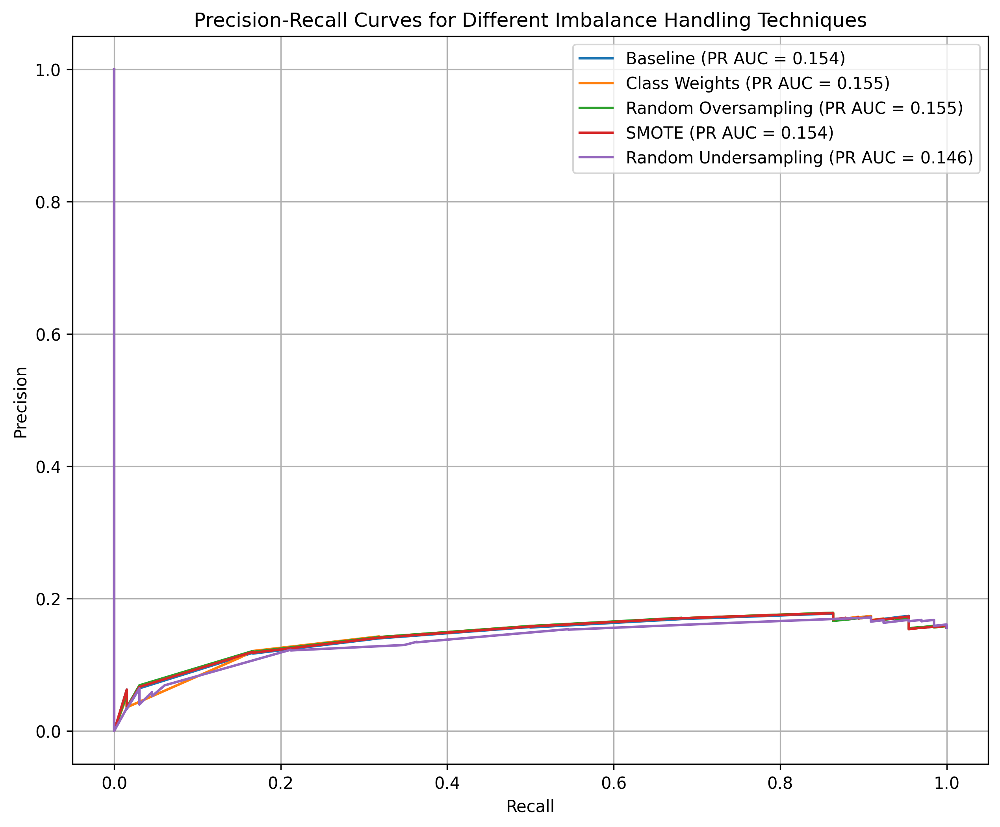
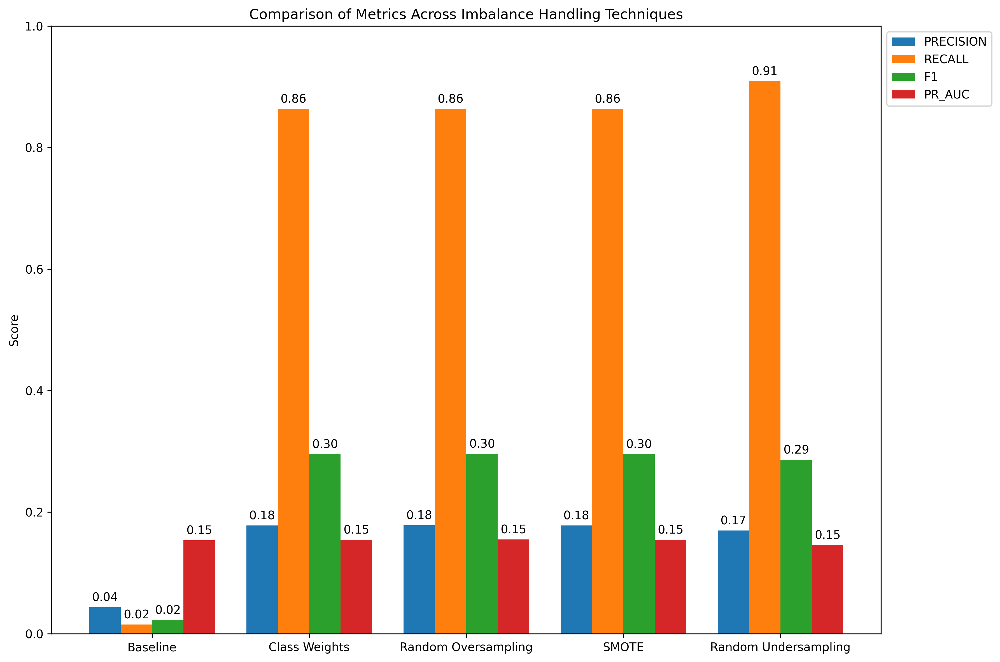
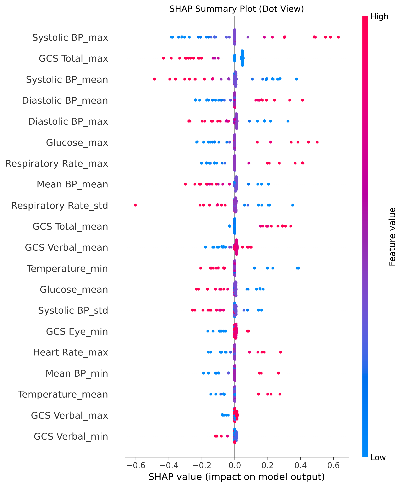
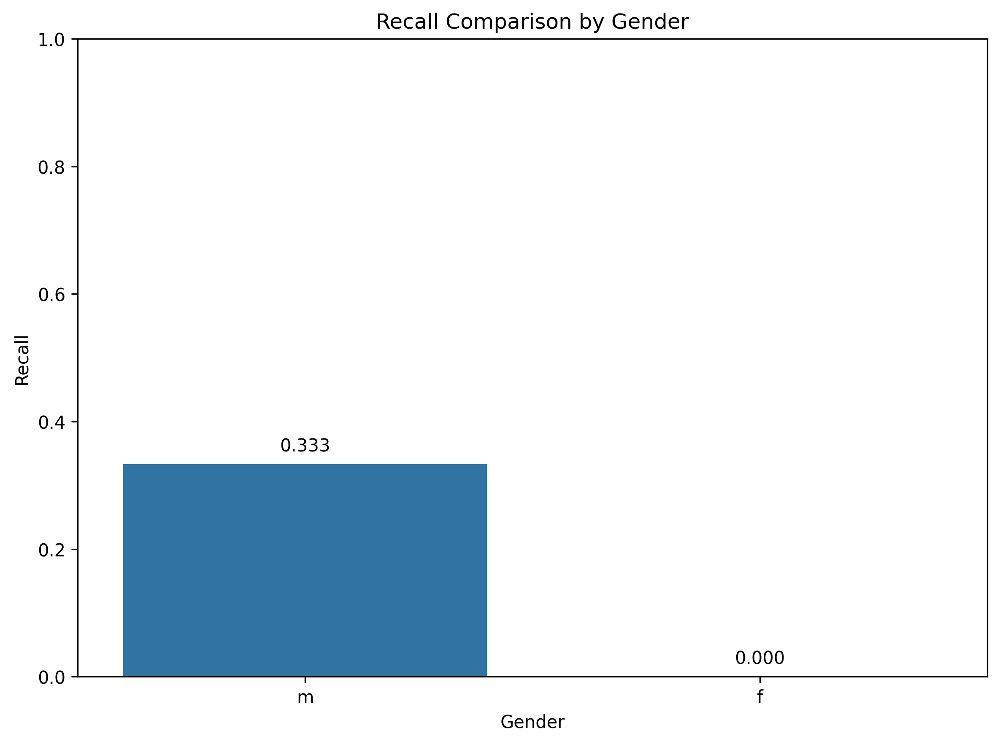

# MIMIC Critical Care Readmission Prediction: An Enterprise-Scale MLOps PoC

## Strategic Proof-of-Concept: Predicting Hospital Readmissions and Intensive Care Outcomes

This project serves as a **Strategic Proof-of-Concept (PoC)** demonstrating a robust, scalable, and enterprise-ready MLOps pipeline for critical care outcome prediction using the complex **MIMIC-III Clinical Database Demo (v1.4)**.

**Prediction Tasks:**
1.  **30-day hospital readmission risk** (Primary Focus)
2.  ICU mortality prediction
3.  Length of stay estimation

**Live Demo & Detailed Overview:** [index.html](index.html) (Open this file locally in a browser)

## Project Goal: Demonstrating Production Readiness

This project utilizes the MIMIC-III *Demo* dataset. While this subset limits the statistical power and generalizability of the specific model results, the **primary objective is to showcase a comprehensive, end-to-end MLOps pipeline built with best practices for reliability, reproducibility, and scalability.**

The focus is on demonstrating:
*   **Software Engineering Rigor:** Clean, modular code (`src/`), comprehensive testing (`tests/`), configuration management (`configs/`), logging (`src/utils/logger.py`), and dependency management (`requirements.txt`).
*   **Advanced Data Handling:** Robust ETL, feature engineering for complex clinical data (`src/features/`), and strategies for handling imbalance (`src/models/imbalance_analysis.py`).
*   **Modern AI Techniques:** Exploration and implementation of temporal models (LSTM PoC), interpretability methods (SHAP), and fairness analysis. Conceptual frameworks for causal inference and generative AI are outlined in [FUTURE_WORK.md](FUTURE_WORK.md).
*   **End-to-End MLOps:** Automated CI/CD (GitHub Actions conceptual example), experiment tracking (MLflow conceptual integration), model monitoring principles, containerization (Docker), and deployment patterns (API via FastAPI, Dashboard via Streamlit).

**The methodology and pipeline architecture are designed to scale effectively to the full MIMIC dataset and real-world EHR systems.**

## Project Status (Using MIMIC-III Demo Data)

This section clarifies the current implementation status of different components within this Proof-of-Concept.

*   **Implemented & Functional:**
    *   **Core Data Pipeline:** Data loading, preprocessing, feature engineering (`src/data/`, `src/features/`).
    *   **Imbalance Analysis:** Implementation and comparison of techniques like SMOTE, Class Weights, Oversampling/Undersampling (`src/models/imbalance_analysis.py`).
    *   **Basic Model Training:** Logistic Regression pipeline training (`src/models/imbalance_analysis.py`).
    *   **Interpretability:** Basic SHAP plots generation (`src/visualization/generate_shap_plots.py`).
    *   **Fairness Analysis:** Basic fairness plots generation (e.g., recall by gender) (`src/visualization/generate_fairness_plots.py`).
    *   **API:** Functional FastAPI endpoint for predictions (`api/`).
    *   **Dashboard:** Functional Streamlit dashboard for visualization (`dashboard/`).
    *   **LSTM PoC:** Initial Time-Aware LSTM proof-of-concept developed in a notebook (`notebooks/advanced_temporal_model_poc.ipynb`).

*   **Conceptual / Future Work (Not Fully Implemented):**
    *   **Advanced Temporal Models:** Full integration and productionization of LSTM or other sequence models.
    *   **Causal Inference:** Implementation of techniques outlined in [FUTURE_WORK.md](FUTURE_WORK.md).
    *   **Full CI/CD Automation:** Production-grade GitHub Actions workflows beyond basic linting/testing (e.g., automated deployment, model registry integration).
    *   **Advanced Monitoring:** Implementation of data/concept drift detection, performance monitoring dashboards (e.g., using tools like Evidently AI).
    *   **Experiment Tracking Integration:** Full integration with MLflow or similar for comprehensive tracking.
    *   **Data/Model Versioning:** Full integration with DVC or similar.
    *   **LLM Integration:** Implementation of LLM-based feature extraction or explanation generation.
    *   **Scalability Testing:** Performance testing on the full MIMIC dataset.

## Key Features & Visualizations

*(Note: Plots generated using the MIMIC-III Demo dataset)*

### 1. Imbalance Handling Analysis
Investigated various techniques to address the significant class imbalance in readmission prediction.
*(See `src/models/imbalance_analysis.py`)*

| PR Curves Comparison | Metrics Comparison |
| :------------------: | :----------------: |
|  |  |
| *Precision-Recall curves showing performance trade-offs.* | *Comparison of Precision, Recall, F1, PR AUC across techniques.* |

### 2. Model Interpretability (SHAP)
Utilized SHAP to understand feature contributions to model predictions for the 'Class Weights' Logistic Regression model.
*(See `src/visualization/generate_shap_plots.py`)*


*SHAP summary plot (beeswarm) showing feature impact on individual predictions.*

### 3. Fairness Analysis
Assessed model performance disparities across demographic groups (e.g., gender) using the recall metric.
*(See `src/visualization/generate_fairness_plots.py`)*


*Comparison of recall scores for Female (f) and Male (m) groups.*

### 4. Advanced Temporal Modeling (PoC)
An initial proof-of-concept using a Time-Aware LSTM with Attention was developed to capture temporal dynamics.
*(See `notebooks/advanced_temporal_model_poc.ipynb` and `notebooks/time_aware_lstm.py`)*

### 5. Causal Inference & Generative AI (Future Work)
Conceptual frameworks for incorporating causal inference techniques (Doubly Robust Estimation, Causal Forests, TMLE) and Generative AI (Synthetic Data, LLM Feature Extraction/Explanation) are detailed in [FUTURE_WORK.md](FUTURE_WORK.md).

## MLOps Pipeline Overview

This project implements a robust MLOps pipeline encompassing:

*   **CI/CD:** Automated testing (linting, unit tests, integration tests), data validation, model evaluation, fairness checks, and model registration using GitHub Actions (conceptual workflow in [FUTURE_WORK.md](FUTURE_WORK.md)).
*   **Experiment Tracking:** Comprehensive logging of parameters, metrics, artifacts (plots, models), code versions, and data versions using MLflow principles (conceptual integration outlined in [FUTURE_WORK.md](FUTURE_WORK.md)).
*   **Monitoring:** Strategies for detecting data drift (PSI, KS-tests), concept drift (performance degradation), and operational issues, potentially visualized via Grafana or specialized tools.
*   **Deployment:** Containerized API (FastAPI) and Dashboard (Streamlit) for serving predictions and insights. Scalable deployment patterns (Blue/Green, Canary) considered for production.
*   **Data & Model Versioning:** Using DVC (conceptual) and MLflow Model Registry for reproducibility and tracking lineage.

## Ethical Considerations & Bias Mitigation

A framework for responsible AI development is crucial:
*   **Fairness Assessment:** Analyzing model performance across sensitive attributes (e.g., gender, ethnicity) as demonstrated (`src/visualization/generate_fairness_plots.py`).
*   **Transparency:** Using interpretability techniques like SHAP and Feature Importance (`assets/feature_coefficients_class_weights.png`).
*   **Bias Mitigation:** Exploring pre-processing, in-processing, and post-processing techniques (future work).
*   **Documentation:** Maintaining clear documentation on ethical considerations ([docs/ethical_considerations.md](docs/ethical_considerations.md)).

## Project Structure

```
mimic-readmission-predictor/
├── assets/                  # Generated plots and results summaries
├── configs/                 # Configuration files (config.yaml, mappings.yaml)
├── data/
│   ├── raw/                 # Raw MIMIC data (requires download)
│   ├── processed/           # Processed datasets (generated by scripts)
│   └── external/            # External datasets (if any)
├── src/
│   ├── data/                # Data processing scripts (make_dataset.py)
│   ├── features/            # Feature engineering (build_features.py, feature_extractors.py)
│   ├── models/              # Model implementations (model.py, imbalance_analysis.py)
│   ├── visualization/       # Visualization scripts (generate_shap_plots.py, etc.)
│   └── utils/               # Utility functions (logger.py, config.py)
├── tests/                   # Unit and integration tests
├── dashboard/               # Streamlit dashboard implementation
├── api/                     # FastAPI implementation
├── docs/                    # Documentation (architecture.md, ethical_considerations.md, etc.)
├── models/                  # Saved model artifacts (e.g., imbalance_pipeline_*.pkl)
├── notebooks/               # Jupyter notebooks for exploration and PoCs
├── .github/                 # CI/CD workflows (conceptual)
├── .gitignore               # Git ignore file
├── LICENSE                  # License file
├── README.md                # This file
├── requirements.txt         # Python dependencies
├── setup.py                 # Package setup
└── FUTURE_WORK.md           # Detailed future enhancements
```

## Getting Started

### Prerequisites

*   Python 3.9+
*   Access to MIMIC-III Clinical Database Demo (v1.4) - Download from PhysioNet and place relevant CSVs (e.g., `PATIENTS.csv`, `ADMISSIONS.csv`, `LABEVENTS.csv`, `CHARTEVENTS.csv`, `D_LABITEMS.csv`, `D_ITEMS.csv`, `ICUSTAYS.csv`, `DIAGNOSES_ICD.csv`, `PROCEDURES_ICD.csv`) in `data/raw/mimic-iii-clinical-database-demo-1.4/` (or update paths in `configs/config.yaml`).
*   Required Python packages.

### Installation

1.  Clone this repository:
    ```bash
    git clone https://github.com/your-github-username/MIMIC_readmission_predictor.git
    cd MIMIC_readmission_predictor
    ```
2.  Install required packages:
    ```bash
    pip install -r requirements.txt
    ```
3.  **(Crucial)** Ensure the MIMIC-III Demo CSV files are placed in the correct `data/raw/` subdirectory as specified in `configs/config.yaml`. Verify the paths in the config file match your setup.

### Basic Workflow Execution

1.  **Process Raw Data:** (Creates processed CSVs in `data/processed/`)
    ```bash
    python -m src.data.make_dataset
    ```
2.  **Build Features:** (Creates `combined_features.csv` in `data/processed/`)
    ```bash
    python -m src.features.build_features
    ```
3.  **Run Imbalance Analysis & Generate Plots/Pipeline:** (Saves plots/CSV to `assets/`, pipeline to `models/`)
    ```bash
    python -m src.models.imbalance_analysis
    ```
4.  **Generate SHAP Plot:** (Requires pipeline from step 3)
    ```bash
    python -m src.visualization.generate_shap_plots --pipeline-path models/imbalance_pipeline_class_weights.pkl
    ```
5.  **Generate Fairness Plot:** (Requires pipeline from step 3)
    ```bash
    python -m src.visualization.generate_fairness_plots --pipeline-path models/imbalance_pipeline_class_weights.pkl --sensitive-attribute gender
    ```
6.  **(Optional) Train a Specific Model:** (Example - trains default model specified in config)
    ```bash
    # python -m src.models.train_model --model readmission
    ```
7.  **(Optional) Run API:**
    ```bash
    # uvicorn api.main:app --reload
    ```
8.  **(Optional) Run Dashboard:**
    ```bash
    # streamlit run dashboard/app.py
    ```

## Technologies and Tools

*   **Languages**: Python 3.9+
*   **Core Libraries**: pandas, numpy, scikit-learn, matplotlib, seaborn, pickle
*   **ML/Stats**: imbalanced-learn, SHAP, scipy.stats
*   **MLOps Tools (Conceptual/Implemented)**: MLflow, DVC, Docker, GitHub Actions, FastAPI, Streamlit, Evidently AI (for monitoring concepts)
*   **Future Tech**: PyTorch (for Deep Learning), PyTorch Geometric/DGL (for GNNs), EconML/CausalML (for Causal Inference), Transformers (for NLP/Sequence)

## License

This project is licensed under the MIT License - see the [LICENSE](LICENSE) file for details.

## Acknowledgments

*   MIMIC-III dataset creators and maintainers.
*   PhysioNet for providing access to the datasets.
